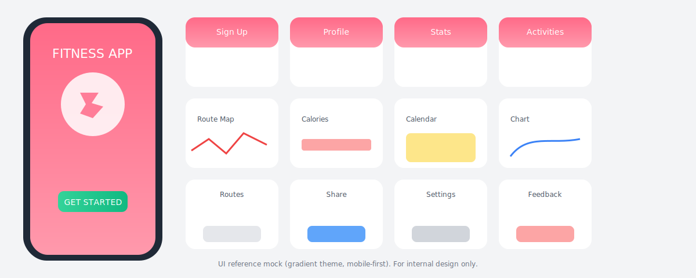

# UI Design Reference

This document provides a visual reference to guide the MVP UI. It is inspired by the provided fitness app screens and aims for a clean, mobile-first layout with a pink gradient theme.

## Reference Assets
- Provided photo: `PRD/assets/reference-app.png` (place the original screenshot here)
- Vector mock: `PRD/assets/ui-reference.svg`

## Notes
- This is an internal design reference for non-commercial planning.
- Button colors follow the project rules: `bg-blue-600` (primary), `bg-gray-200` (secondary), `bg-red-600` (danger).
- MVP screens to mimic:
  - Landing / Get Started
  - Routes Library (tabs)
  - Route Detail with map viewer
  - Share flow (invite link/code)

## Guidance
- Keep typography simple (Inter or system fonts), large touch targets, and generous spacing.
- Use the pink gradient for header sections; content cards remain white with subtle shadow.
- Navigation tabs at the bottom for mobile ergonomics.